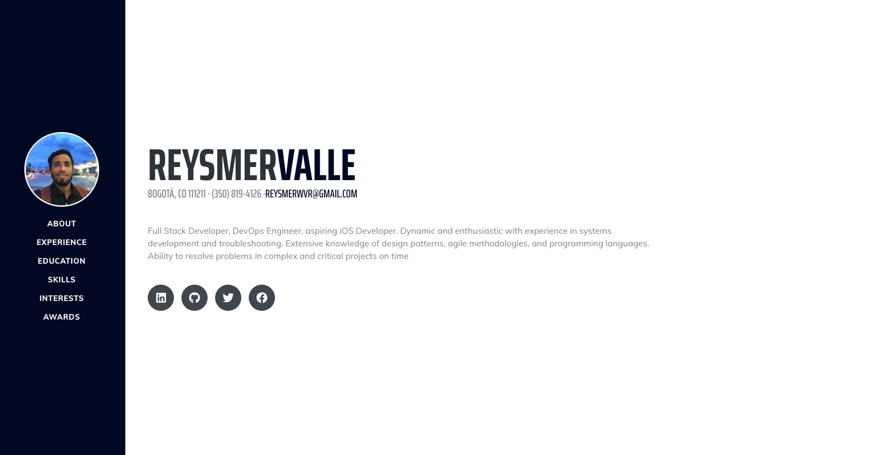

# React Personal Resume

React Personal Resume

## Requirements

- React >= 16.12.0
- npm >= 6.13.4

## Version

1.0.0

## Installation

Download zip file and extract it [latest release](https://github.com/reysmerwvr/rv-resume). Or clone the repository and cd into it.

React Personal Resume uses a number of open source projects to work properly:

- [React] - A JavaScript library for building user interfaces
- [Start Bootstrap - Resume] - startbootstrap-resume (Base Template)

Install the dependencies and start the server.

```sh
cd rv-resume
npm install
```

## Running with NPM

Run the following command to start the HTTP Server.

```sh
npm start # Run React App
```

## Preview



### Todos

- Write tests
- Add code comments

[//]: # (These are reference links used in the body of this note and get stripped out when the markdown processor does 
its job. There is no need to format nicely because it shouldn't be seen. Thanks SO - http://stackoverflow.com/questions/4823468/store-comments-in-markdown-syntax)

   [React]: <https://reactjs.org//>
   [Start Bootstrap - Resume]: <https://github.com/BlackrockDigital/startbootstrap-resume>
